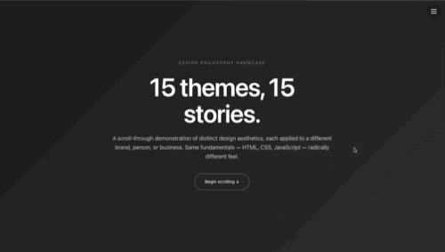

# 15 Themes / 15 Stories — Design Philosophy 🎨
A scroll-through demonstration of fifteen distinct design philosophies, each applied to a different brand, person, or business — all built with the same fundamentals (HTML, CSS, JavaScript) and zero dependencies. The same career story, the same business pitch, the same form fields can feel radically different depending on the design language wrapping them. This project proves it.

👤 Author
Jacqueline 
- [Live Demo](https://jdbostonbu-ops.github.io/CSS-Fifteen-Theme-Exploration/) | 
[GitHub Profile](https://github.com/jdbostonbu-ops)

  

15 Themes Showcase Demo

🎓 Built During Next Chapter — Phase I
This project was designed and built during Phase I of Thinking with AI at Next Chapter Apprenticeship — a four-month foundational sprint covering AI Prompting, CSS, HTML, and Forms. Each lab fed directly into this build:

AI Prompting — Refining prompts to produce design philosophies that feel intentional, not generic. Pushing back when output didn't match the vision. Treating AI as a thinking partner, not a code generator.
HTML — Semantic structure, accessibility, real-world markup patterns. Every theme uses proper heading hierarchy, landmark regions, and meaningful element choices.
CSS — Custom properties, Grid, Flexbox, animation, transitions, and @media (prefers-reduced-motion) accessibility. Fifteen themes meant fifteen distinct color systems, type scales, and layout grids.
Forms — Every theme has a working contact form with proper labels, validation, and submission handling. The booking flow in Theme 08 includes a full multi-stage form, calendar, and time-slot picker.
The project is the deliverable that demonstrates everything Phase I covered, in one continuous scroll.

🌐 Browser & Device Compatibility
Browser / Device	Status	Performance Notes
Google Chrome	✅ Optimized	Full support — Canvas animations, glassmorphic blur, scroll reveals, calendar booking flow.
Microsoft Edge	✅ Optimized	Matches Chrome rendering engine exactly.
Firefox	✅ Supported	Full feature support including backdrop-filter.
Apple Safari (macOS)	✅ Supported	All features functional including 3D card flips and SVG animations.
Safari (iOS)	✅ Supported	Touch interactions, smooth scroll, and form flows fully functional.
iPad / iPadOS	✅ Supported	Responsive grids adapt correctly to tablet viewports.
Android Chrome	✅ Supported	Full mobile compatibility.
🌟 Key Features
15 Distinct Design Philosophies: Each theme is a complete, scrollable landing page with its own hero, sections, animations, and contact form — radically different visual languages, same underlying technology.
Floating Theme Navigator: Persistent top-right circular button opens a slide-in panel listing all 15 themes — jump to any one in a single click.
Live Neural Network Animation (Theme 06): Canvas-rendered neural network with four layers and traveling pulses, built with requestAnimationFrame and retina-aware scaling, paused via IntersectionObserver when off-screen for battery efficiency.
Full Culinary Geometry Integration (Theme 08): The complete codebase from a previous portfolio project, scope-prefixed to .theme-08 and integrated as the front-end agency theme — 1,400+ lines of CSS and 480 lines of JavaScript, faithfully preserved.
Animated Stat Counters (Themes 03 + 10): Numbers count up from zero using requestAnimationFrame with ease-out-cubic, triggered by IntersectionObserver.
Multi-Stage Booking Flow (Theme 08): Calendar → time slot picker → project details form → animated success state with SVG checkmark drawing animation.
Accessibility First: Every animation respects @media (prefers-reduced-motion). Every form has proper labels and keyboard navigation. Every external link uses rel="noopener".
Zero Dependencies: Pure Vanilla HTML5, CSS3, and JavaScript ES6+ — no frameworks, no build tools, no npm.
🎨 The 15 Themes
#	Subject	Theme Philosophy	Palette
01	About Me · Jacqueline	Minimalist Editorial — generous whitespace, serif headlines, restrained accents	Cream / Charcoal / Terracotta
02	About Me · Jacqueline	Terminal / Hacker — monospace, scanlines, glitch text, blinking cursor	Black / Matrix Green / Magenta
03	About Me · Jacqueline	Corporate Professional — photo-driven hero, conservative motion, stat counters	Navy / White / Gold
04	Eliana Reyes · Journalist	Newspaper Editorial — masthead, drop caps, sepia photography, pull quotes	Ivory / Ink Black / Oxblood
05	Marcus Chen · Software Engineer	Dark Technical — grid background, JetBrains Mono, system cards	Deep Blue-Black / Electric Cyan
06	Aiyana Patel · AI Researcher	Neural / Research Lab — Canvas neural network, sparse SVG icons	Lab-Dark / Sage-Mint
07	Sam Whitaker · Junior Developer	Playful / Indie — gradient blobs, hand-drawn shadows, rotated cards	Cream / Coral / Mint / Yellow
08	Studio Fusion · Front-End Agency	Tri-Style Fusion — Neo-Brutalist + Glassmorphic + Cinematic Grid combined	Matte Black / Fiery Orange
09	Doña Mira's · Food Truck	Neo-Brutalist — hard borders, oversized type, scrolling marquee	Cream / Charcoal / Alarm Red
10	Bridge IT · Apprenticeship Non-Profit	Trust / Civic / Mission-Driven — warmth, real numbers, named outcomes	Warm Off-White / Deep Teal / Amber
11	Second Chapter · Justice-Impacted Resources	Humanitarian / Plain-Language — privacy-first, dignified, no glossy stock	Soft Cream / Slate-Blue / Warm Coral
12	Maison Halcyon · Wedding Planner	Luxe Editorial — full-bleed photography, Roman numerals, gold dividers	Cream / Charcoal / Antique Gold
13	Verdant · Plant Nursery	Botanical / Organic — animated SVG leaves, asymmetric border radii	Cream / Forest Green / Clay
14	Halden & Cole · Architecture Firm	Editorial Monochrome — massive typography, asymmetric grids, taupe accent	White / Near-Black / Taupe
15	Marble Hill Books · Independent Bookstore	Vintage Typographic — Roman numeral dates, ornamental flourishes, drop caps	Warm Cream / Forest / Ochre / Oxblood
🛠️ Tech Stack
Frontend: Vanilla JavaScript (ES6+) — IntersectionObserver, requestAnimationFrame, Canvas 2D API, event delegation, focus management, smooth scroll
Styling: CSS3 — Custom Properties, CSS Grid, Flexbox, transform-style: preserve-3d, backdrop-filter, clip-path, @keyframes, custom cubic-bezier easing, prefers-reduced-motion, clamp() for fluid typography
Typography: Inter, Crimson Pro, Playfair Display, JetBrains Mono — system fonts and Google Fonts
Images: Unsplash CDN with loading="lazy" for performance
Storage: No backend, no cookies, no localStorage — stateless on every load
Deployment: GitHub Pages — zero-config static hosting
🚀 The User Flow
Land → intro banner explains the showcase concept and links to Theme 01
Scroll continuously through 15 themes → each theme has its own hero, sections, animations, and contact form
Use the floating navigator → click the circular button in the top-right to jump between themes
Submit any contact form → see the theme-appropriate success message and form reset
Test the booking flow in Theme 08 → click "Book a Discovery Call" or "Enquire About Workshops" to flip into a multi-stage form or interactive calendar
📋 Sections per Theme
Every theme includes these elements, styled distinctly:

Hero — name/title, subhead, primary CTA, theme-specific decoration
About / Bio / Profile — narrative content matching the subject
Work / Services / Portfolio — what the subject does or has done
Quote — pull-quote or testimonial, styled to the theme's voice
Contact / Inquiry Form — working form with labels, validation, and success state
Footer — meta information, established date, location
🎓 Future Vision
Real Backend Integration: Wire any of the contact forms to Formspree, Netlify Forms, or a Calendly embed.
Theme Switcher: Add a single toggle that lets visitors apply any theme's style to their own content.
More Themes: Cyberpunk, Swiss/International Typographic, Brutalist 2.0, Y2K, Memphis Group.
Accessibility Audit: Run each theme through WAVE and axe-core; document and fix any issues.
Performance Pass: Lazy-load themes that are off-screen; reduce initial CSS bundle by code-splitting per theme.
🎓 Background
This project is part of a non-traditional path into software engineering — 12 years running a full-service insurance agency (systems design, data modeling, risk analysis), 3 years as a Behavior Detection & Analysis Officer with the Department of Homeland Security (real-time anomaly detection, pattern classification), now applied to building accessible, AI-powered web applications. The 15 themes are a portfolio of design judgment — proof that the same person can build a wedding planner's luxe site, a justice-impacted resource hub, and a fintech engineer's dark-technical portfolio without any of them feeling like they came from the same template.

⭐ Love this project? Give it a star and explore the other deployed projects in this portfolio.